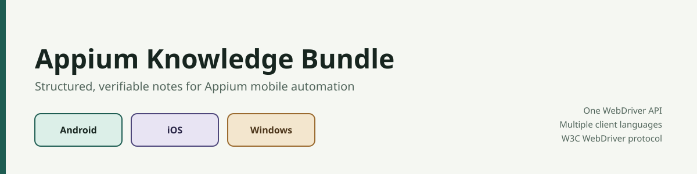

# Appium Knowledge Bundle

A documentation-first knowledge bundle for Appium mobile automation. It collects practical, structured notes on designing, configuring, running, and troubleshooting Appium-based tests — organized as a topic map you can read end to end or jump into for a specific question.

## What this bundle offers

- **A clear mental model of Appium**: what it is, how the client-server architecture works under the hood (REST over HTTP, sessions, desired capabilities), and how the W3C WebDriver protocol replaced the JSON Wire Protocol from Appium 2.x onward.
- **Language and platform coverage**: which client libraries are available (Java, JavaScript, Python, C#, PHP, Ruby) and how Appium reaches native automation on Android (UiAutomator2) and iOS (XCUITest, WebDriverAgent).
- **Honest tool comparisons**: how Appium stacks up against platform-specific tools like XCTest, Robotium, UI Automator, and Espresso, including where each one is actually the better choice.
- **Real limitations, not just advantages**: environment requirements, infrastructure trade-offs between local device labs and cloud providers, and where to check for breaking changes between releases.
- **Diagrams over walls of text**: each topic pairs concise explanations with a diagram or table so the concept is quick to scan and easy to verify.

Every topic in this bundle is meant to be concise, verifiable, and linked back to an authoritative source wherever possible.

## Specification

This repository is being organized against the Google OKF 0.2 specification.

The knowledge topics and source mappings are maintained at the repository root as the bundle is developed.

## Structure

- `index.md`: knowledge bundle entry point and topic map
- `introduction.md`: Appium Introduction topic
- `assets/images/`: images used by knowledge topics
- `assets/code/`: reusable reference code examples

## Status

The Introduction topic (what Appium is, its architecture, supported languages, advantages, tool comparisons, and limitations) is complete. Remaining topics — drivers and platforms, desired capabilities, locators, gestures, test organization, troubleshooting, and reference material — are in progress; see [index.md](index.md) for the full topic map.
