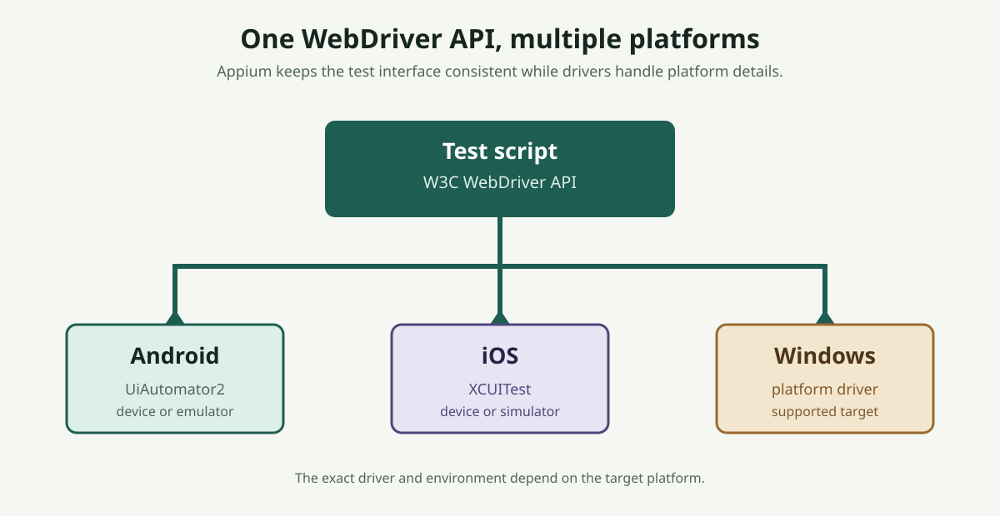
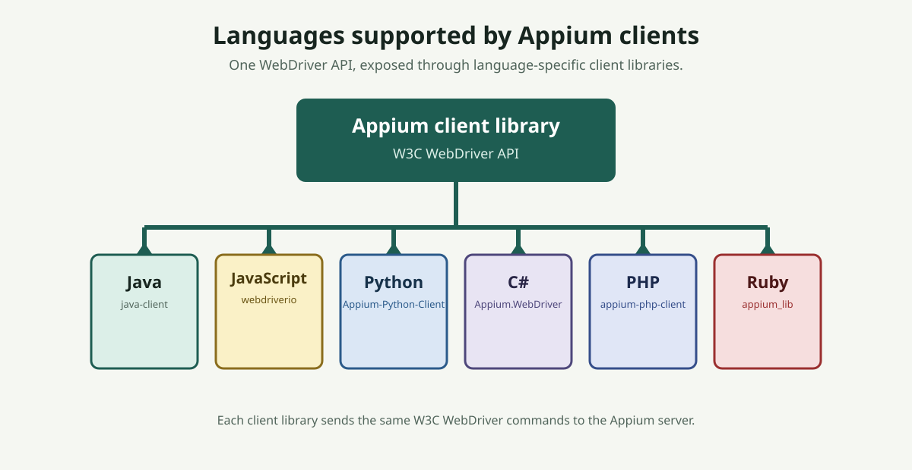
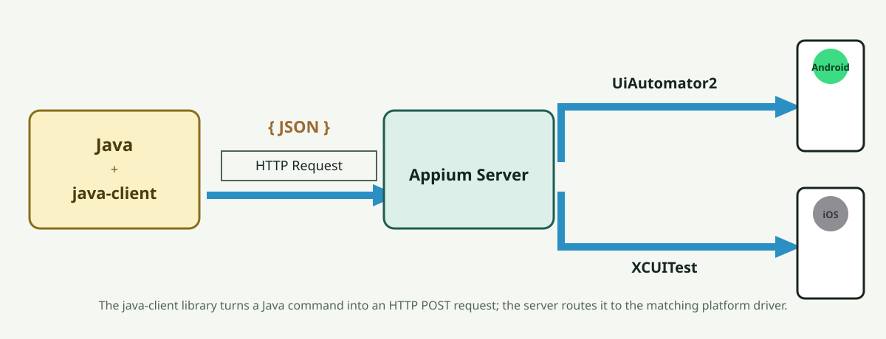
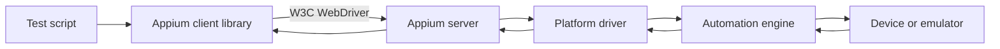
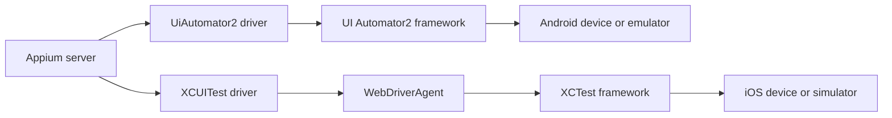
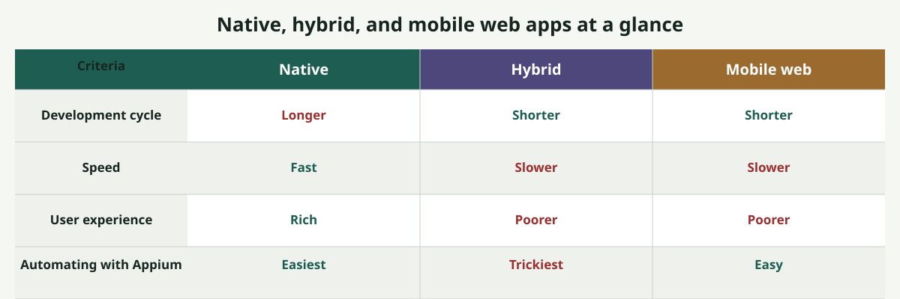
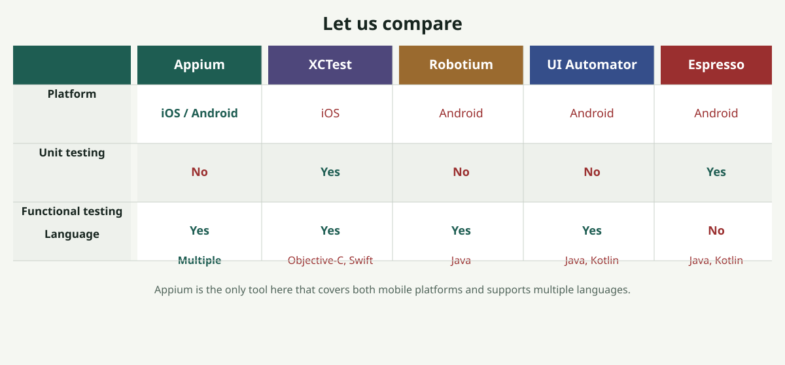

# Appium Introduction

## Topic map

- [What is Appium?](#what-is-appium)
- [Supported languages](#supported-languages)
- [How Appium works: architecture overview](#how-appium-works-architecture-overview)
- [Types of mobile apps](#types-of-mobile-apps)
- [Advantages of Appium](#advantages-of-appium)
- [Appium compared with platform-specific tools](#appium-compared-with-platform-specific-tools)
- [Limitations and considerations](#limitations-and-considerations)

## What is Appium?

Appium is an open-source automation framework for testing mobile applications and mobile web experiences. It can automate native, hybrid, and mobile web applications through standard WebDriver client libraries.

Appium is cross-platform. A test team can use the same WebDriver-based API across supported platforms, while the platform-specific driver and automation engine handle the details for the target device or emulator. Supported targets can include Android, iOS, and Windows automation scenarios, depending on the installed driver and environment.

Appium supports multiple programming languages because its clients expose the WebDriver API in language-specific libraries. Common choices include Java, JavaScript, Python, C#, PHP, and Ruby.

For a minimal Python session example, see [`assets/code/basic-session.py`](assets/code/basic-session.py).

## Supported languages

Appium is built on Selenium, and Selenium already supports many programming languages. Appium inherits that same flexibility: every Appium client library sends the same underlying W3C WebDriver commands, so a team can pick the language that fits its existing stack without changing how Appium behaves on the server or driver side.

| Language | Client library |
| --- | --- |
| Java | [java-client](https://github.com/appium/java-client) |
| JavaScript | [webdriverio](https://webdriver.io/) (maintained outside the Appium GitHub org) |
| Python | [python-client](https://github.com/appium/python-client) |
| C# | [dotnet-client](https://github.com/appium/dotnet-client) |
| PHP | [php-client](https://github.com/appium-boneyard/php-client) (community-maintained, in the appium-boneyard org) |
| Ruby | [ruby_lib](https://github.com/appium/ruby_lib) (`appium_lib` gem) |

See the [client drivers ecosystem page](https://github.com/appium/appium/blob/master/packages/appium/docs/en/ecosystem/clients.md) in the appium/appium repo for the full, current list.

## How Appium works: architecture overview

Appium uses a client-server automation model:

- A test script uses an Appium client library, such as the Java, Python, JavaScript, or C# client.
- The Appium server receives WebDriver commands and manages the automation session.
- A platform driver translates those commands for a specific platform and automation technology.
- The device or emulator executes the resulting actions and returns state, element, or error information.

Underneath this model, the Appium server is a Node.js HTTP server that exposes a REST API, so it listens for HTTP requests the same way any other web server does. An automation framework integrates the matching client library as a regular dependency — for example, a Maven or Gradle dependency for the Java client, an npm package for the JavaScript client, or a pip package for the Python client. Each client library's job is to convert that language's commands into the matching HTTP request and send it to the server; for example, the Java client turns a Java command into an HTTP POST request. When a client creates a new session, the server returns a session ID, and the client includes that same session ID on every following request so the server knows which session it belongs to.

Appium's client-server API is based on the Selenium WebDriver API, and the protocol history of the two projects tracks together. Selenium 3.x supported both the JSON Wire Protocol and the W3C WebDriver protocol; Selenium 4.x removed the JSON Wire Protocol completely and uses W3C WebDriver only, and all major browsers (Chrome, Firefox, and others) follow that same W3C standard. Because Appium is based on WebDriver, Appium 1.x likewise supported both protocols, and Appium 2.x switched to the W3C WebDriver protocol completely, matching Selenium 4.x. The W3C WebDriver protocol is based on the same client-server architecture described above; W3C means World Wide Web Consortium, the international community that develops standards for the web.

See Appium's own explainers for more detail: [How Does Appium Work?](https://github.com/appium/appium/blob/master/packages/appium/docs/en/intro/appium.md) and [Appium Project History](https://github.com/appium/appium/blob/master/packages/appium/docs/en/intro/history.md), both in the appium/appium repo.

### Main components

1. **Test script**: Defines the scenario, assertions, and user actions.
2. **Appium client**: Provides language-specific APIs and sends WebDriver requests.
3. **Appium server**: A Node.js HTTP server that creates sessions, routes commands, and coordinates drivers.
4. **Platform driver**: Connects Appium to a target platform. Appium 2 drivers are installed and managed separately from the server.
5. **Automation engine**: Uses the platform's automation technology to locate elements and perform actions.
6. **Device or emulator**: Runs the application under test and reports results.

A session begins when the client sends a set of desired capabilities, such as which platform (Android or iOS), which app, and other properties that define how the test should run. The server uses those capabilities to select a compatible driver, creates a session, and returns a session identifier. Subsequent commands use that session until the test ends it or the session is terminated. See the Desired capabilities and session configuration topic for the full set of options.

### Platform drivers and native automation

Appium reaches the native automation technology on each platform through a dedicated driver:

- **Android**: Appium drives the session with the [UiAutomator2 driver](https://github.com/appium/appium-uiautomator2-driver), which talks to Android's UI Automator2 framework. As with other Appium 2 drivers, it is installed separately from the server. Android automation also relies on the [Appium Settings](https://github.com/appium/io.appium.settings) companion app and ADB commands for tasks the UI Automator2 framework does not cover on its own.
- **iOS**: Appium drives the session with the [XCUITest driver](https://github.com/appium/appium-xcuitest-driver), which talks to Apple's XCTest native framework. On the device side, the XCUITest driver communicates through a [WebDriverAgent](https://github.com/appium/WebDriverAgent) server, which bridges WebDriver commands to XCTest calls.

The native framework performs the requested command on the application and returns a response back through the driver to the Appium server, which relays it to the client. WebDriverAgent, the Appium Settings app, and ADB each get their own dedicated coverage in later topics. For the full, current driver list, see the [driver ecosystem page](https://github.com/appium/appium/blob/master/packages/appium/docs/en/ecosystem/drivers.md) in the appium/appium repo.

## Types of mobile apps

### Native apps

Native apps are built for a particular mobile operating system using its platform SDK and UI components, developed separately per platform — for example, Java or Kotlin for Android and Swift for iOS. They generally expose native elements to Appium and are automated through platform-specific drivers.

Examples include an Android app built with Kotlin and an iOS app built with Swift.

- **Development cycle**: Longer, since the Android and iOS versions are built and maintained as separate codebases.
- **Speed**: Fast, because the app uses the platform SDK's own native components directly — including things like the native keyboard, date pickers, permission dialogs, and other apps such as the camera.
- **User experience**: Rich, with fast screen transitions and full access to native UI components.
- **Automating with Appium**: Easiest to automate — UI elements are identified natively, no driver context switching is required, and elements are straightforward to inspect with the Appium Inspector.

### Hybrid apps

Hybrid apps combine native application screens with embedded web content, commonly displayed in a WebView — a native container that renders standard web content (HTML, JavaScript, and CSS) using the platform's browser engine. Because that WebView content is platform-agnostic, it can be built once and reused across platforms. Tests may need to switch between a native context and a web context during the same session.

- **Development cycle**: Shorter than a fully native app, depending on how much of the UI is WebView content, since that content is built once and reused across platforms.
- **Speed**: Comparatively slower, since the WebView content (HTML, CSS, JavaScript) has to load like a web page.
- **User experience**: Comparatively poorer, since WebView content is not optimized to interact with native components.
- **Automating with Appium**: Trickiest to automate — tests require driver context switching between the native and web contexts, and the Appium Inspector cannot inspect WebView elements directly (other mechanisms are covered in a later topic). On Android, the app must have debug mode enabled before its WebView elements can be inspected.

### Mobile web apps

Mobile web apps run in a mobile browser rather than being installed as an app. Appium automates browser interactions through WebDriver, including navigation, web elements, and browser contexts. There are two common designs:

- **Adaptive web apps**: built specifically for a mobile screen, deliberately exposing a reduced feature set compared to the full desktop site.
- **Responsive web apps**: load the same full feature set as the desktop site, with a layout that adjusts to fit the screen size.

- **Development cycle**: Shorter, since the same web application serves desktop and mobile with only responsive or adaptive design changes.
- **Speed**: Comparatively slower, since browser elements take time to load.
- **User experience**: Comparatively poorer, since the site is not optimized specifically for a mobile screen.
- **Automating with Appium**: Easy to automate — no driver context switching is required, so it is essentially the same as automating the desktop site, and the same element locators generally carry over. Elements are also easy to inspect using a desktop browser's own inspector.

## Advantages of Appium

- **Cross-platform API**: The WebDriver API provides a common programming model across supported platforms.
- **Multiple language clients**: Teams can choose a language such as Java, JavaScript, Python, C#, PHP, or Ruby.
- **Real and virtual devices**: Appium can automate physical devices, Android emulators, and iOS simulators.
- **Testing the actual application**: Tests generally do not require the application to be recompiled or modified specifically for automation.
- **Broad functional testing fit**: Appium is well suited to end-to-end and functional testing across mobile platforms. Platform-native unit tests are usually a better fit for testing individual application units.
- **Open-source ecosystem**: Appium has an active community and an ecosystem of platform drivers and client libraries.
- **Backed by Sauce Labs**: Appium's development and support is backed by Sauce Labs, one of the most widely used cloud device testing platforms, which adds credibility to the tool. Cloud providers such as Sauce Labs and Perfecto Mobile support Appium as a mobile automation framework rather than competing with it.

## Appium compared with platform-specific tools

Appium is often compared with other open-source tools that target one platform or one testing layer (cloud service providers like Sauce Labs and Perfecto Mobile are not included here, since they support Appium rather than compete with it):

| Tool | Platform focus | Language support | Typical strength |
| --- | --- | --- | --- |
| Appium | Android, iOS, and supported additional targets | Java, JavaScript, Python, C#, PHP, Ruby | Cross-platform functional testing |
| XCTest | iOS | Objective-C, Swift | Native iOS unit and UI testing |
| Robotium | Android | Java | Android functional testing |
| UI Automator | Android | Java, Kotlin | Android UI and device interaction |
| Espresso | Android | Java, Kotlin | Fast, close-to-application Android UI testing |

Appium is the clear winner on platform support (both Android and iOS) and on programming language support, since the other tools are each tied to a single platform and a narrower set of languages. For unit testing, Appium is comparatively slower and less suitable; XCTest and Espresso are better suited there because of their tight, fast integration with the application code. For functional testing, Appium is the strongest overall choice because it covers both platforms, while XCTest, Robotium, and UI Automator can each handle functional testing but only within their single supported platform.

## Limitations and considerations

- **iOS environment requirements**: Local iOS automation requires macOS and the required Xcode tooling.
- **Infrastructure management**: A local Appium server lab is practical for a small setup, such as two or four devices connected to a single Mac or Windows machine. Scaling automation beyond that becomes a problem to manage locally; cloud device providers, where devices are managed separately and available on demand, reduce this infrastructure burden.
- **Documentation depth**: Some Appium documentation and driver documentation can be technical, so teams should validate examples against the installed Appium and driver versions.
- **Platform changes**: Changes in iOS, Xcode, Android, or a platform automation engine (such as XCTest) can potentially break Appium, though this is not frequent. Upgrade Appium, drivers, operating systems, and automation tooling together, and check the currently open issues on the [Appium GitHub issues page](https://github.com/appium/appium/issues) before and after upgrading.

## Next Topic

Next: [Drivers and platforms](index.md#topics)

## References

- [W3C WebDriver specification](https://www.w3.org/TR/webdriver/)
- [Appium documentation](https://appium.io/docs/en/latest/) (built from the [appium/appium docs source](https://github.com/appium/appium/tree/master/packages/appium/docs/en))
- [Appium GitHub issues](https://github.com/appium/appium/issues)
- [Appium GitHub organization](https://github.com/appium) — server, drivers, client libraries, and related tooling
