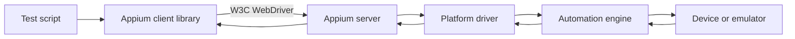

# Appium Introduction

## Topic map

- [What is Appium?](#what-is-appium)
- [Supported languages](#supported-languages)
- [How Appium works: architecture overview](#how-appium-works-architecture-overview)
- [Types of mobile apps](#types-of-mobile-apps)
- [Advantages of Appium](#advantages-of-appium)
- [Appium compared with platform-specific tools](#appium-compared-with-platform-specific-tools)
- [Limitations and considerations](#limitations-and-considerations)

## What is Appium?

Appium is an open-source automation framework for testing mobile applications and mobile web experiences. It can automate native, hybrid, and mobile web applications through standard WebDriver client libraries.

Appium is cross-platform. A test team can use the same WebDriver-based API across supported platforms, while the platform-specific driver and automation engine handle the details for the target device or emulator. Supported targets can include Android, iOS, and Windows automation scenarios, depending on the installed driver and environment.

Appium supports multiple programming languages because its clients expose the WebDriver API in language-specific libraries. Common choices include Java, JavaScript, Python, C#, PHP, and Ruby.

For a minimal Python session example, see [`assets/code/basic-session.py`](assets/code/basic-session.py).

## Supported languages

Appium is built on Selenium, and Selenium already supports many programming languages. Appium inherits that same flexibility: every Appium client library sends the same underlying W3C WebDriver commands, so a team can pick the language that fits its existing stack without changing how Appium behaves on the server or driver side.

| Language | Client library |
| --- | --- |
| Java | java-client |
| JavaScript | webdriverio |
| Python | Appium-Python-Client |
| C# | Appium.WebDriver |
| PHP | appium-php-client |
| Ruby | appium_lib |

## How Appium works: architecture overview

Appium uses a client-server automation model:

- A test script uses an Appium client library, such as the Java, Python, JavaScript, or C# client.
- The Appium server receives WebDriver commands and manages the automation session.
- A platform driver translates those commands for a specific platform and automation technology.
- The device or emulator executes the resulting actions and returns state, element, or error information.

Appium 2.x uses the W3C WebDriver protocol. The older JSON Wire Protocol is not part of the Appium 2.x protocol model. W3C means World Wide Web Consortium, the standards organization that maintains the WebDriver specification.

### Main components

1. **Test script**: Defines the scenario, assertions, and user actions.
2. **Appium client**: Provides language-specific APIs and sends WebDriver requests.
3. **Appium server**: Creates sessions, routes commands, and coordinates drivers.
4. **Platform driver**: Connects Appium to a target platform. Appium 2 drivers are installed and managed separately from the server.
5. **Automation engine**: Uses the platform's automation technology to locate elements and perform actions.
6. **Device or emulator**: Runs the application under test and reports results.

A session begins when the client sends W3C capabilities. The server selects a compatible driver, creates a session, and returns a session identifier. Subsequent commands use that session until the test ends it or the session is terminated.

## Types of mobile apps

### Native apps

Native apps are built for a particular mobile operating system using its platform SDK and UI components. They generally expose native elements to Appium and are automated through platform-specific drivers.

Examples include an Android app built with Kotlin and an iOS app built with Swift.

### Mobile web apps

Mobile web apps run in a mobile browser. Appium automates browser interactions through WebDriver, including navigation, web elements, and browser contexts.

### Hybrid apps

Hybrid apps combine native application screens with embedded web content, commonly displayed in a WebView. Tests may need to switch between a native context and a web context during the same session.

## Advantages of Appium

- **Cross-platform API**: The WebDriver API provides a common programming model across supported platforms.
- **Multiple language clients**: Teams can choose a language such as Java, JavaScript, Python, C#, PHP, or Ruby.
- **Real and virtual devices**: Appium can automate physical devices, Android emulators, and iOS simulators.
- **Testing the actual application**: Tests generally do not require the application to be recompiled or modified specifically for automation.
- **Broad functional testing fit**: Appium is well suited to end-to-end and functional testing across mobile platforms. Platform-native unit tests are usually a better fit for testing individual application units.
- **Open-source ecosystem**: Appium has an active community and an ecosystem of platform drivers and client libraries.
- **Backed by Sauce Labs**: Appium's development and support is backed by Sauce Labs, one of the most widely used cloud device testing platforms, which adds credibility to the tool. Cloud providers such as Sauce Labs and Perfecto Mobile support Appium as a mobile automation framework rather than competing with it.

## Appium compared with platform-specific tools

Appium is often compared with other open-source tools that target one platform or one testing layer (cloud service providers like Sauce Labs and Perfecto Mobile are not included here, since they support Appium rather than compete with it):

| Tool | Platform focus | Language support | Typical strength |
| --- | --- | --- | --- |
| Appium | Android, iOS, and supported additional targets | Java, JavaScript, Python, C#, PHP, Ruby | Cross-platform functional testing |
| XCTest | iOS | Objective-C, Swift | Native iOS unit and UI testing |
| Robotium | Android | Java | Android functional testing |
| UI Automator | Android | Java, Kotlin | Android UI and device interaction |
| Espresso | Android | Java, Kotlin | Fast, close-to-application Android UI testing |

Appium is the clear winner on platform support (both Android and iOS) and on programming language support, since the other tools are each tied to a single platform and a narrower set of languages. For unit testing, Appium is comparatively slower and less suitable; XCTest and Espresso are better suited there because of their tight, fast integration with the application code. For functional testing, Appium is the strongest overall choice because it covers both platforms, while XCTest, Robotium, and UI Automator can each handle functional testing but only within their single supported platform.

## Limitations and considerations

- **iOS environment requirements**: Local iOS automation requires macOS and the required Xcode tooling.
- **Infrastructure management**: A local Appium server lab is practical for a small setup, such as two or four devices connected to a single Mac or Windows machine. Scaling automation beyond that becomes a problem to manage locally; cloud device providers, where devices are managed separately and available on demand, reduce this infrastructure burden.
- **Documentation depth**: Some Appium documentation and driver documentation can be technical, so teams should validate examples against the installed Appium and driver versions.
- **Platform changes**: Changes in iOS, Xcode, Android, or a platform automation engine (such as XCTest) can potentially break Appium, though this is not frequent. Upgrade Appium, drivers, operating systems, and automation tooling together, and check the currently open issues on the [Appium GitHub issues page](https://github.com/appium/appium/issues) before and after upgrading.

## Next Topic

Next: [Drivers and platforms](index.md#topics)

## References

- [W3C WebDriver specification](https://www.w3.org/TR/webdriver/)
- [Appium documentation](https://appium.io/docs/en/latest/)
- [Appium GitHub issues](https://github.com/appium/appium/issues)
