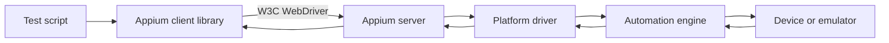
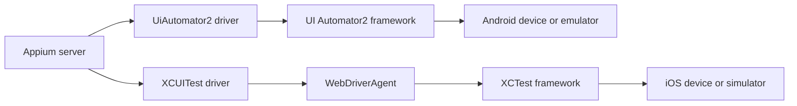

Appium uses a client-server automation model:

- A test script uses an Appium client library, such as the Java, Python, JavaScript, or C# client.
- The Appium server receives WebDriver commands and manages the automation session.
- A platform driver translates those commands for a specific platform and automation technology.
- The device or emulator executes the resulting actions and returns state, element, or error information.

Underneath this model, the Appium server is a Node.js HTTP server that exposes a REST API, so it listens for HTTP requests the same way any other web server does. An automation framework integrates the matching client library as a regular dependency — for example, a Maven or Gradle dependency for the Java client, an npm package for the JavaScript client, or a pip package for the Python client. Each client library's job is to convert that language's commands into the matching HTTP request and send it to the server; for example, the Java client turns a Java command into an HTTP POST request. When a client creates a new session, the server returns a session ID, and the client includes that same session ID on every following request so the server knows which session it belongs to.

Appium's client-server API is based on the Selenium WebDriver API, and the protocol history of the two projects tracks together. Selenium 3.x supported both the JSON Wire Protocol and the W3C WebDriver protocol; Selenium 4.x removed the JSON Wire Protocol completely and uses W3C WebDriver only, and all major browsers (Chrome, Firefox, and others) follow that same W3C standard. Because Appium is based on WebDriver, Appium 1.x likewise supported both protocols, and Appium 2.x switched to the W3C WebDriver protocol completely, matching Selenium 4.x. The W3C WebDriver protocol is based on the same client-server architecture described above; W3C means World Wide Web Consortium, the international community that develops standards for the web.

See Appium's own explainers for more detail: [How Does Appium Work?](https://github.com/appium/appium/blob/master/packages/appium/docs/en/intro/appium.md) and [Appium Project History](https://github.com/appium/appium/blob/master/packages/appium/docs/en/intro/history.md), both in the appium/appium repo.

# Main components

1. **Test script**: Defines the scenario, assertions, and user actions.
2. **Appium client**: Provides language-specific APIs and sends WebDriver requests.
3. **Appium server**: A Node.js HTTP server that creates sessions, routes commands, and coordinates drivers.
4. **Platform driver**: Connects Appium to a target platform. Appium 2 drivers are installed and managed separately from the server.
5. **Automation engine**: Uses the platform's automation technology to locate elements and perform actions.
6. **Device or emulator**: Runs the application under test and reports results.

A session begins when the client sends a set of desired capabilities, such as which platform (Android or iOS), which app, and other properties that define how the test should run. The server uses those capabilities to select a compatible driver, creates a session, and returns a session identifier. Subsequent commands use that session until the test ends it or the session is terminated. See the Desired capabilities and session configuration topic for the full set of options.

# Platform drivers and native automation

Appium reaches the native automation technology on each platform through a dedicated driver:

- **Android**: Appium drives the session with the [UiAutomator2 driver](https://github.com/appium/appium-uiautomator2-driver), which talks to Android's UI Automator2 framework. As with other Appium 2 drivers, it is installed separately from the server. Android automation also relies on the [Appium Settings](https://github.com/appium/io.appium.settings) companion app and ADB commands for tasks the UI Automator2 framework does not cover on its own.
- **iOS**: Appium drives the session with the [XCUITest driver](https://github.com/appium/appium-xcuitest-driver), which talks to Apple's XCTest native framework. On the device side, the XCUITest driver communicates through a [WebDriverAgent](https://github.com/appium/WebDriverAgent) server, which bridges WebDriver commands to XCTest calls.

The native framework performs the requested command on the application and returns a response back through the driver to the Appium server, which relays it to the client. WebDriverAgent and the Appium Settings app each get their own dedicated coverage in later topics. For how this driver mechanism generalizes to any platform, and the current catalog of official and community drivers, see [Appium ecosystem and drivers](/driver-ecosystem/index.md).

